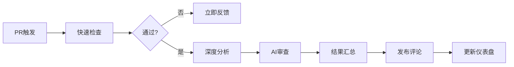

# AI Agent 自动化代码审查工作流设计方案

> **文档版本**: v1.0  
> **设计日期**: 2026-07-02  
> **适用团队**: 15名开发者，日均20+ PR  
> **目标**: 构建智能化、可自愈的代码审查系统

---

## 目录

1. [系统架构概览](#1-系统架构概览)
2. [代码规范检查规则集](#2-代码规范检查规则集)
3. [自动化审查流水线设计](#3-自动化审查流水线设计)
4. [常见问题模式库](#4-常见问题模式库)
5. [审查意见优先级分类与自动标注](#5-审查意见优先级分类与自动标注)
6. [Agent 自学习机制](#6-agent-自学习机制)
7. [与 CI/CD 集成方案](#7-与-cicd-集成方案)
8. [审查效果度量指标与仪表盘](#8-审查效果度量指标与仪表盘)
9. [实施路线图](#9-实施路线图)
10. [附录](#10-附录)

---

## 1. 系统架构概览

### 1.1 核心设计理念

- **分层防御**: 静态分析 → AI审查 → 人工复核
- **持续优化**: 从反馈中学习，减少误报
- **开发者友好**: 快速反馈，清晰指引
- **可观测性**: 全链路追踪与度量

### 1.2 系统组件

```
┌─────────────────────────────────────────────────────────────┐
│                     GitHub PR Event                          │
└────────────────────────┬────────────────────────────────────┘
                         │
                         ▼
┌─────────────────────────────────────────────────────────────┐
│              Trigger Layer (触发层)                          │
│  • PR创建/更新  • 特定label  • 定时批量  • 手动触发          │
└────────────────────────┬────────────────────────────────────┘
                         │
                         ▼
┌─────────────────────────────────────────────────────────────┐
│         Static Analysis Layer (静态分析层)                   │
│  • Linter (ESLint/Pylint/Checkstyle)                       │
│  • Security Scanner (CodeQL/Semgrep)                       │
│  • Complexity Analyzer (SonarQube)                          │
└────────────────────────┬────────────────────────────────────┘
                         │
                         ▼
┌─────────────────────────────────────────────────────────────┐
│           AI Review Layer (AI审查层)                        │
│  • Pattern Matching (规则引擎)                              │
│  • LLM Analysis (GPT-4/Claude)                             │
│  • Context Understanding (RAG + 知识库)                     │
└────────────────────────┬────────────────────────────────────┘
                         │
                         ▼
┌─────────────────────────────────────────────────────────────┐
│         Decision Layer (决策层)                             │
│  • Priority Classification (优先级分类)                     │
│  • Auto-annotation (自动标注)                               │
│  • Filter & Rank (过滤与排序)                               │
└────────────────────────┬────────────────────────────────────┘
                         │
                         ▼
┌─────────────────────────────────────────────────────────────┐
│          Feedback Layer (反馈层)                            │
│  • PR Comment (PR评论)                                     │
│  • Review Status (审查状态)                                │
│  • Dashboard Update (仪表盘更新)                           │
└────────────────────────┬────────────────────────────────────┘
                         │
                         ▼
┌─────────────────────────────────────────────────────────────┐
│        Learning Layer (学习层)                              │
│  • Feedback Collection (反馈收集)                           │
│  • Pattern Extraction (模式提取)                            │
│  • Model Fine-tuning (模型微调)                             │
└─────────────────────────────────────────────────────────────┘
```

---

## 2. 代码规范检查规则集

### 2.1 命名规范

#### 2.1.1 变量命名

| 语言 | 规则 | 示例 |
|------|------|------|
| JavaScript/TypeScript | camelCase | `userName`, `isActive` |
| Python | snake_case | `user_name`, `is_active` |
| Java | camelCase | `userName`, `isActive` |
| Go | camelCase (导出PascalCase) | `userName`, `UserName` |
| Rust | snake_case (类型PascalCase) | `user_name`, `UserName` |

**AI检查提示词**:
```
检查变量命名是否符合语言惯例：
1. 识别代码语言
2. 提取所有变量声明
3. 验证命名格式
4. 检查语义清晰度（避免a, b, temp等）
5. 标记不符合规范的命名
```

#### 2.1.2 函数/方法命名

- **动词开头**: `getUser`, `calculateTotal`, `validateInput`
- **语义明确**: 避免`processData`, `handleThing`等模糊命名
- **长度适中**: 3-50字符，反映功能复杂度

#### 2.1.3 类/接口/类型命名

- **PascalCase**: `UserController`, `ApiResponse`, `UserData`
- **后缀规范**: 
  - 接口: `UserService` (无前缀) 或 `IUserService` (匈牙利命名)
  - 抽象类: `BaseController`, `AbstractRepository`
  - 异常: `ValidationError`, `ApiException`

### 2.2 格式规范

#### 2.2.1 缩进与空格

```yaml
规则:
  indent_style: space
  indent_size: 2  # JS/TS/Python
  indent_size: 4  # Java/Go/C#
  end_of_line: lf
  charset: utf-8
  trim_trailing_whitespace: true
  insert_final_newline: true
```

#### 2.2.2 行长限制

- **软限制**: 80-100字符 (建议换行)
- **硬限制**: 120字符 (必须换行)
- **例外**: URL、正则表达式、长字符串

#### 2.2.3 括号与换行

```javascript
// Good: K&R风格
if (condition) {
  doSomething();
} else {
  doOtherThing();
}

// Bad: Allman风格 (Java/C#除外)
if (condition)
{
  doSomething();
}
```

### 2.3 复杂度检查

#### 2.3.1 圈复杂度 (Cyclomatic Complexity)

| 级别 | 复杂度 | 行动 |
|------|--------|------|
| 简单 | 1-5 | ✅ 通过 |
| 中等 | 6-10 | ⚠️ 警告 |
| 复杂 | 11-15 | ❌ 建议重构 |
| 极高 | >15 | ❌ 必须重构 |

**检查工具配置**:
```javascript
// .eslintrc.js
module.exports = {
  rules: {
    'complexity': ['error', { max: 10 }],
    'max-depth': ['error', { max: 4 }],
    'max-nested-callbacks': ['error', { max: 3 }],
    'max-params': ['error', { max: 5 }],
    'max-statements': ['error', { max: 15 }]
  }
};
```

#### 2.3.2 函数长度

- **建议**: < 30行
- **警告**: 30-50行
- **拒绝**: > 50行

#### 2.3.3 文件长度

- **建议**: < 300行
- **警告**: 300-500行
- **拒绝**: > 500行

### 2.4 安全漏洞检查

#### 2.4.1 OWASP Top 10 检查规则

| 漏洞类型 | 检查模式 | 严重等级 |
|---------|---------|---------|
| SQL注入 | 字符串拼接SQL | 🔴 Critical |
| XSS | 未转义用户输入 | 🔴 Critical |
| 敏感信息泄露 | 硬编码密钥/密码 | 🔴 Critical |
| 不安全的反序列化 | 未验证的反序列化 | 🟠 High |
| 组件漏洞 | 已知CVE依赖 | 🟠 High |
| 身份认证失效 | 弱密码策略 | 🟡 Medium |
| 访问控制缺陷 | 缺失权限检查 | 🟡 Medium |

#### 2.4.2 安全检查配置

```yaml
# .semgrep.yml
rules:
  - id: hardcoded-secret
    pattern-regex: |
      (password|secret|key|token)\s*=\s*["'][^"']+["']
    message: Possible hardcoded secret
    severity: ERROR
    
  - id: sql-injection
    pattern-either:
      - pattern: |
          "SELECT ... " + $VAR
      - pattern: |
          f"SELECT ... {$VAR}"
    message: Possible SQL injection
    severity: ERROR
```

---

## 3. 自动化审查流水线设计

### 3.1 触发条件

#### 3.1.1 事件触发

```yaml
# .github/workflows/ai-review.yml
name: AI Code Review

on:
  pull_request:
    types: [opened, synchronize, reopened]
    branches: [main, develop, release/*]
  
  # 手动触发
  workflow_dispatch:
    inputs:
      pr_number:
        description: 'PR number to review'
        required: true
      
  # 定时批量审查
  schedule:
    - cron: '0 2 * * *'  # 每天凌晨2点
```

#### 3.1.2 条件过滤

```javascript
// 触发条件判断逻辑
function shouldTriggerReview(pr) {
  const filters = {
    // 跳过Draft PR
    isDraft: pr.draft === false,
    
    // 跳过特定label
    excludedLabels: !pr.labels.some(l => 
      ['skip-review', 'WIP', 'experiment'].includes(l.name)
    ),
    
    // 最小改动行数
    minChanges: pr.additions + pr.deletions > 10,
    
    // 特定文件类型
    relevantFiles: pr.files.some(f => 
      ['.js', '.ts', '.py', '.java', '.go'].some(ext => 
        f.filename.endsWith(ext)
      )
    )
  };
  
  return Object.values(filters).every(v => v === true);
}
```

### 3.2 检查步骤

#### 3.2.1 流水线阶段



#### 3.2.2 详细步骤

```yaml
# 阶段1: 快速检查 (2分钟内)
stage1_quick_check:
  timeout: 2min
  steps:
    - name: Lint检查
      run: npm run lint
      continue-on-error: true
    
    - name: 格式检查
      run: npm run format:check
    
    - name: 类型检查
      run: npm run type-check
    
    - name: 单元测试
      run: npm run test:unit -- --changed

# 阶段2: 深度分析 (5-10分钟)
stage2_deep_analysis:
  timeout: 10min
  needs: stage1_quick_check
  if: ${{ always() }}
  steps:
    - name: 复杂度分析
      run: npm run analyze:complexity
    
    - name: 安全扫描
      run: npm run security:scan
    
    - name: 依赖检查
      run: npm audit --production
    
    - name: AI模式匹配
      run: node .github/scripts/pattern-match.js

# 阶段3: AI审查 (3-5分钟)
stage3_ai_review:
  timeout: 5min
  needs: stage2_deep_analysis
  steps:
    - name: 上下文提取
      run: node .github/scripts/extract-context.js
    
    - name: LLM分析
      run: node .github/scripts/llm-review.js
      env:
        OPENAI_API_KEY: ${{ secrets.OPENAI_API_KEY }}
    
    - name: 结果聚合
      run: node .github/scripts/aggregate-results.js
```

### 3.3 结果汇总

#### 3.3.1 汇格式

```markdown
## 🤖 AI Code Review Report

### 📊 概览
- **检查时间**: 2026-07-02 17:30:00
- **总耗时**: 8分23秒
- **检查结果**: ❌ 需要修改 (2 Critical, 3 Warning)

### 🔴 Critical Issues (必须修复)

#### 1. SQL注入风险
- **文件**: `src/models/User.js`
- **行号**: 45
- **代码**:
  ```javascript
  const query = `SELECT * FROM users WHERE id = ${userId}`;
  ```
- **建议**: 使用参数化查询
  ```javascript
  const query = 'SELECT * FROM users WHERE id = ?';
  db.query(query, [userId]);
  ```

### ⚠️ Warnings (建议修复)

#### 1. 函数复杂度过高
- **文件**: `src/controllers/OrderController.js`
- **函数**: `processOrder`
- **复杂度**: 12 (建议 < 10)
- **建议**: 拆分为多个子函数

### ✅ passed (通过)

- ✅ 命名规范
- ✅ 格式规范
- ✅ 单元测试覆盖率 > 80%

### 📈 质量评分
- **代码质量**: 72/100
- **安全评分**: 60/100
- **可维护性**: 75/100

---

*由 AI Agent 自动生成 | [查看详情](https://dashboard.example.com/pr/123)*
```

#### 3.3.2 结果发布

```javascript
// .github/scripts/publish-review.js
async function publishReview(prNumber, reviewResult) {
  // 1. 删除旧评论
  const oldComments = await github.issues.listComments({
    owner,
    repo,
    issue_number: prNumber,
    per_page: 100
  });
  
  const botComments = oldComments.data.filter(c => 
    c.user.login === 'ai-reviewer[bot]'
  );
  
  for (const comment of botComments) {
    await github.issues.deleteComment({
      owner,
      repo,
      comment_id: comment.id
    });
  }
  
  // 2. 发布新评论
  await github.issues.createComment({
    owner,
    repo,
    issue_number: prNumber,
    body: reviewResult.markdown
  });
  
  // 3. 更新PR标签
  const labels = calculateLabels(reviewResult);
  await github.issues.addLabels({
    owner,
    repo,
    issue_number: prNumber,
    labels
  });
  
  // 4. 设置审查状态
  if (reviewResult.criticalIssues > 0) {
    await github.checks.create({
      owner,
      repo,
      name: 'AI Code Review',
      status: 'completed',
      conclusion: 'failure',
      output: {
        title: 'Critical issues found',
        summary: `Found ${reviewResult.criticalIssues} critical issues`
      }
    });
  }
}
```

---

## 4. 常见问题模式库

### 4.1 性能反模式

#### 4.1.1 数据库N+1查询

**模式识别**:
```javascript
// ❌ 反模式
async function getUsersWithPosts() {
  const users = await User.findAll();
  for (const user of users) {
    user.posts = await Post.findAll({ where: { userId: user.id } });
  }
  return users;
}

// ✅ 正确做法
async function getUsersWithPosts() {
  const users = await User.findAll({
    include: [{ model: Post }]
  });
  return users;
}
```

**AI检测提示词**:
```
检测N+1查询模式：
1. 在循环中查找数据库查询调用
2. 识别是否在循环外部已有主查询
3. 计算预期查询次数 (N+1)
4. 建议批量查询或预加载
```

#### 4.1.2 大O复杂度问题

| 反模式 | 时间复杂度 | 优化方案 |
|--------|-----------|---------|
| 嵌套循环查找 | O(n²) | 使用Hash Map |
| 频繁DOM操作 | O(n)次重绘 | 批量更新 |
| 同步I/O | O(n)阻塞 | 使用异步/并发 |
| 未分页查询 | O(n)内存 | 添加分页 |

#### 4.1.3 内存泄漏

```javascript
// ❌ 反模式: 事件监听器未移除
element.addEventListener('click', handler);
// 组件卸载时未移除

// ✅ 正确做法
useEffect(() => {
  element.addEventListener('click', handler);
  return () => element.removeEventListener('click', handler);
}, []);
```

### 4.2 安全风险

#### 4.2.1 注入攻击

```javascript
// ❌ SQL注入
const query = `SELECT * FROM users WHERE name = '${name}'`;

// ✅ 参数化查询
const query = 'SELECT * FROM users WHERE name = ?';
db.query(query, [name]);

// ❌ NoSQL注入
User.find({ name: req.body.name });

// ✅ 输入验证
const name = validator.escape(req.body.name);
User.find({ name });
```

#### 4.2.2 身份认证漏洞

```javascript
// ❌ 弱密码存储
const passwordHash = md5(password);

// ✅ 强密码存储
const passwordHash = await bcrypt.hash(password, 10);

// ❌ 会话固定
session.id = req.params.sessionId;

// ✅ 安全会话
session.regenerate(() => {
  session.userId = user.id;
});
```

#### 4.2.3 CSRF/XSS

```javascript
// ❌ 未转义输出
res.send(`<h1>Welcome ${req.params.name}</h1>`);

// ✅ 转义输出
res.send(`<h1>Welcome ${escape(req.params.name)}</h1>`);

// ✅ 使用模板引擎自动转义
res.render('welcome', { name: req.params.name });
```

### 4.3 可维护性问题

#### 4.3.1 代码重复

```javascript
// ❌ 重复代码
function calculateArea1(width, height) { return width * height; }
function calculateArea2(w, h) { return w * h; }

// ✅ 提取公共函数
function calculateArea(width, height) { return width * height; }
```

**检测阈值**:
- 相同代码行数 > 6行
- 相似度 > 80%
- 跨文件重复

#### 4.3.2 魔法数字

```javascript
// ❌ 魔法数字
if (user.age > 18) { ... }
setTimeout(callback, 30000);

// ✅ 常量定义
const ADULT_AGE = 18;
const REQUEST_TIMEOUT = 30000;
if (user.age > ADULT_AGE) { ... }
setTimeout(callback, REQUEST_TIMEOUT);
```

#### 4.3.3 深度嵌套

```javascript
// ❌ 深层嵌套
if (user) {
  if (user.isActive) {
    if (user.hasPermission) {
      if (user.profile) {
        // ...
      }
    }
  }
}

// ✅ 提前返回
if (!user || !user.isActive || !user.hasPermission || !user.profile) {
  return;
}
// ...
```

---

## 5. 审查意见优先级分类与自动标注

### 5.1 优先级分类体系

#### 5.1.1 四级分类

| 级别 | 标签 | 含义 | 示例 | 处理方式 |
|------|------|------|------|---------|
| 🔴 P0 - Critical | `critical` | 必须修复才能合并 | 安全漏洞、数据丢失风险 | 阻止PR合并 |
| 🟠 P1 - High | `bug` | 强烈建议修复 | 逻辑错误、性能问题 | 要求修改或添加TODO |
| 🟡 P2 - Medium | `enhancement` | 建议修复 | 代码异味、可维护性 | 可合并，记录tech debt |
| 🟢 P3 - Low | `suggestion` | 可选优化 | 命名改进、格式问题 | 仅供参考 |

#### 5.1.2 自动标注规则

```javascript
// 优先级判断逻辑
function classifyIssue(issue) {
  const rules = [
    {
      condition: (i) => i.type === 'security' && i.severity === 'high',
      priority: 'critical',
      labels: ['security', 'critical']
    },
    {
      condition: (i) => i.type === 'bug' && i.confidence > 0.8,
      priority: 'high',
      labels: ['bug']
    },
    {
      condition: (i) => i.type === 'performance' && i.impact === 'high',
      priority: 'high',
      labels: ['performance']
    },
    {
      condition: (i) => i.type === 'style' || i.type === 'format',
      priority: 'low',
      labels: ['style']
    }
  ];
  
  for (const rule of rules) {
    if (rule.condition(issue)) {
      return {
        priority: rule.priority,
        labels: rule.labels
      };
    }
  }
  
  return { priority: 'medium', labels: ['enhancement'] };
}
```

### 5.2 自动标注实现

#### 5.2.1 GitHub Labels 配置

```yaml
# .github/labels.yml
labels:
  - name: critical
    color: 'B60205'
    description: 'Critical issue that must be fixed'
  
  - name: bug
    color: 'D93F0B'
    description: 'Something is not working'
  
  - name: enhancement
    color: 'A2EEEF'
    description: 'Improvement suggestion'
  
  - name: suggestion
    color: '0E8A16'
    description: 'Optional optimization'
  
  - name: security
    color: 'FF0000'
    description: 'Security vulnerability'
  
  - name: performance
    color: 'FFA500'
    description: 'Performance improvement'
  
  - name: style
    color: '006B75'
    description: 'Code style issue'
```

#### 5.2.2 自动打标签

```javascript
// .github/scripts/auto-label.js
async function autoLabelPR(prNumber, reviewResult) {
  const labels = new Set();
  
  // 根据审查结果添加标签
  if (reviewResult.criticalIssues > 0) {
    labels.add('critical');
  }
  
  if (reviewResult.securityIssues > 0) {
    labels.add('security');
  }
  
  if (reviewResult.performanceIssues > 0) {
    labels.add('performance');
  }
  
  if (reviewResult.hasStyleIssues) {
    labels.add('style');
  }
  
  // 根据文件类型添加标签
  const fileTypes = extractFileTypes(reviewResult.files);
  if (fileTypes.has('test')) {
    labels.add('test');
  }
  
  // 应用标签
  await github.issues.addLabels({
    owner,
    repo,
    issue_number: prNumber,
    labels: Array.from(labels)
  });
}
```

### 5.3 特殊标注

#### 5.3.1 首次出现模式

```javascript
// 检测到新的代码模式时
if (isNewPattern(issue)) {
  labels.add('new-pattern');
  await notifyTeam({
    message: `发现新的代码模式: ${issue.pattern}`,
    pr: prNumber
  });
}
```

#### 5.3.2 重复问题

```javascript
// 检测到历史问题中常见的模式
if (isRecurringIssue(issue)) {
  labels.add('recurring');
  const similarIssues = await findSimilarIssues(issue);
  comment += `\n\n📌 **类似问题**: 该问题在过去出现过 ${similarIssues.length} 次`;
}
```

---

## 6. Agent 自学习机制

### 6.1 反馈收集

#### 6.1.1 反馈来源

```javascript
// 收集反馈的渠道
const feedbackSources = {
  // 1. 显式反馈 (开发者主动)
  explicit: {
    // PR评论中的reaction
    reactions: async (commentId) => {
      const reactions = await github.reactions.listForComment({
        comment_id: commentId
      });
      return {
        helpful: reactions.data.find(r => r.content === 'THUMBS_UP'),
        notHelpful: reactions.data.find(r => r.content === 'THUMBS_DOWN')
      };
    },
    
    // 评论回复
    replies: async (commentId) => {
      const replies = await github.issues.listComments({
        ...
      });
      return replies.filter(r => r.in_reply_to_id === commentId);
    },
    
    // 手动标注
    manualLabels: async (prNumber) => {
      const labels = await github.issues.listLabelsOnIssue({
        issue_number: prNumber
      });
      return labels.data;
    }
  },
  
  // 2. 隐式反馈 (行为推断)
  implicit: {
    // 是否修改代码
    codeChanged: async (prNumber, commentTimestamp) => {
      const commits = await github.pulls.listCommits({
        pull_number: prNumber
      });
      return commits.data.some(c => 
        new Date(c.commit.author.date) > commentTimestamp
      );
    },
    
    // 是否合并PR
    isMerged: async (prNumber) => {
      const pr = await github.pulls.get({
        pull_number: prNumber
      });
      return pr.data.merged;
    },
    
    // 修复时间
    fixTime: async (prNumber, issueLine) => {
      const commits = await getCommitsAfterIssue(prNumber, issueLine);
      return commits[0]?.timestamp - issueTimestamp;
    }
  }
};
```

#### 6.1.2 反馈数据存储

```sql
-- 反馈数据表结构
CREATE TABLE review_feedback (
  id SERIAL PRIMARY KEY,
  pr_number INTEGER NOT NULL,
  comment_id BIGINT NOT NULL,
  issue_type VARCHAR(50),
  issue_line INTEGER,
  predicted_priority VARCHAR(20),
  actual_priority VARCHAR(20),
  is_accepted BOOLEAN,
  is_fixed BOOLEAN,
  fix_time_minutes INTEGER,
  user_feedback VARCHAR(20),  -- 'helpful', 'not_helpful', 'neutral'
  created_at TIMESTAMP DEFAULT NOW(),
  updated_at TIMESTAMP DEFAULT NOW()
);

-- 模式库表
CREATE TABLE issue_patterns (
  id SERIAL PRIMARY KEY,
  pattern_hash VARCHAR(64) UNIQUE,
  pattern_type VARCHAR(50),
  language VARCHAR(20),
  detection_rule JSONB,
  true_positive_rate FLOAT DEFAULT 0.5,
  false_positive_count INTEGER DEFAULT 0,
  true_positive_count INTEGER DEFAULT 0,
  last_seen TIMESTAMP DEFAULT NOW(),
  created_at TIMESTAMP DEFAULT NOW()
);
```

### 6.2 模式提取

#### 6.2.1 从修复中学习

```python
# 分析代码变更，提取修复模式
def extract_fix_pattern(original_code, fixed_code):
    # 1. 计算diff
    diff = difflib.unified_diff(
        original_code.splitlines(),
        fixed_code.splitlines(),
        lineterm=''
    )
    
    # 2. 提取变更模式
    changes = parse_diff(diff)
    
    # 3. 抽象为通用模式
    pattern = {
        'type': detect_change_type(changes),  # 'refactor', 'fix', 'optimize'
        'before': abstract_code(original_code),
        'after': abstract_code(fixed_code),
        'triggers': extract_triggers(changes),
        'context': extract_context(original_code)
    }
    
    # 4. 存储到模式库
    save_pattern(pattern)
    
    return pattern

# 示例: 从SQL注入修复中学习
# 原始代码: f"SELECT * FROM users WHERE id = {user_id}"
# 修复代码: "SELECT * FROM users WHERE id = %s", (user_id,)
# 提取模式:
# {
#   type: 'security_fix',
#   pattern: 'parameterized_query',
#   before: 'string_format_sql',
#   after: 'prepared_statement',
#   rule: 'use_parameterized_query'
# }
```

#### 6.2.2 聚类分析

```python
# 使用聚类发现新的问题模式
from sklearn.feature_extraction.text import TfidfVectorizer
from sklearn.cluster import DBSCAN

def discover_new_patterns(issues):
    # 1. 特征提取
    vectorizer = TfidfVectorizer(max_features=1000)
    X = vectorizer.fit_transform([i['code_snippet'] for i in issues])
    
    # 2. 聚类
    clustering = DBSCAN(eps=0.3, min_samples=5)
    labels = clustering.fit_predict(X)
    
    # 3. 提取每个聚类的特征
    patterns = []
    for cluster_id in set(labels):
        if cluster_id == -1:
            continue  # 噪声
        
        cluster_issues = [issues[i] for i, l in enumerate(labels) if l == cluster_id]
        pattern = {
            'id': cluster_id,
            'count': len(cluster_issues),
            'common_features': extract_common_features(cluster_issues),
            'example': cluster_issues[0]
        }
        patterns.append(pattern)
    
    # 4. 人工审核新发现的模式
    return patterns
```

### 6.3 模型优化

#### 6.3.1 提示词优化

```python
# 基于反馈优化LLM提示词
def optimize_prompt(feedback_data):
    # 1. 分析误报
    false_positives = feedback_data[feedback_data['is_accepted'] == False]
    
    # 2. 提取误报特征
    fp_features = extract_features(false_positives)
    
    # 3. 更新提示词
    prompt_template = """
    你是一个代码审查专家。请审查以下代码并识别问题。
    
    特别注意:
    {dynamic_rules}
    
    常见问题模式:
    {pattern_examples}
    
    避免误报:
    {false_positive_examples}
    """
    
    # 4. 动态生成规则
    dynamic_rules = generate_rules(fp_features)
    pattern_examples = get_top_patterns(n=10)
    fp_examples = get_false_positive_examples(n=5)
    
    optimized_prompt = prompt_template.format(
        dynamic_rules=dynamic_rules,
        pattern_examples=pattern_examples,
        false_positive_examples=fp_examples
    )
    
    return optimized_prompt
```

#### 6.3.2 规则权重调整

```python
# 调整检测规则的权重
def adjust_rule_weights(feedback_data):
    for rule in detection_rules:
        # 计算规则的准确率
        true_positives = feedback_data[
            (feedback_data['rule'] == rule.id) & 
            (feedback_data['is_accepted'] == True)
        ].count()
        
        false_positives = feedback_data[
            (feedback_data['rule'] == rule.id) & 
            (feedback_data['is_accepted'] == False)
        ].count()
        
        accuracy = true_positives / (true_positives + false_positives + 1e-10)
        
        # 调整权重
        if accuracy < 0.5:
            rule.weight *= 0.8  # 降低权重
            rule.enabled = False if accuracy < 0.3 else True
        elif accuracy > 0.8:
            rule.weight *= 1.2  # 提高权重
        
        # 保存更新
        save_rule(rule)
```

### 6.4 持续学习流程

```yaml
# 每周自动学习任务
name: Agent Self-Learning

on:
  schedule:
    - cron: '0 1 * * 0'  # 每周日凌晨1点

jobs:
  learn:
    runs-on: ubuntu-latest
    steps:
      - name: 收集上周反馈
        run: node .github/scripts/collect-feedback.js
      
      - name: 分析误报率
        run: python .github/scripts/analyze-false-positives.py
      
      - name: 提取新图案
        run: python .github/scripts/extract-patterns.py
      
      - name: 优化提示词
        run: python .github/scripts/optimize-prompts.py
      
      - name: 更新规则库
        run: node .github/scripts/update-rules.js
      
      - name: 生成学习报告
        run: node .github/scripts/generate-learning-report.js
      
      - name: 提交更新
        uses: actions/create-pull-request@v3
        with:
          title: 'chore: AI Agent self-learning update'
          body: |
            ## 🤖 AI Agent 自动学习更新
            
            ### 📊 本周统计
            - 收集反馈: ${{ steps.collect.outputs.feedback_count }}
            - 新发现模式: ${{ steps.extract.outputs.new_patterns }}
            - 优化规则: ${{ steps.optimize.outputs.optimized_rules }}
            
            ### 🔧 更新内容
            - 提示词优化
            - 规则权重调整
            - 模式库更新
```

---

## 7. 与 CI/CD 集成方案

### 7.1 GitHub Actions 集成

#### 7.1.1 完整工作流配置

```yaml
# .github/workflows/ai-review.yml
name: AI Code Review

on:
  pull_request:
    types: [opened, synchronize, reopened]
  
  # 允许手动触发
  workflow_dispatch:

permissions:
  contents: read
  pull-requests: write
  issues: write
  checks: write

jobs:
  # Job 1: 快速检查
  quick-check:
    runs-on: ubuntu-latest
    outputs:
      should_continue: ${{ steps.check.outputs.should_continue }}
    steps:
      - uses: actions/checkout@v4
        with:
          fetch-depth: 0
      
      - name: Setup Node.js
        uses: actions/setup-node@v4
        with:
          node-version: '20'
      
      - name: Install dependencies
        run: npm ci
      
      - name: Run linters
        run: |
          npm run lint
          npm run format:check
        continue-on-error: true
      
      - name: Check if should continue
        id: check
        run: |
          if [ "${{ github.event.pull_request.changed_files }}" -lt 10 ]; then
            echo "should_continue=false" >> $GITHUB_OUTPUT
          else
            echo "should_continue=true" >> $GITHUB_OUTPUT
          fi
  
  # Job 2: AI审查
  ai-review:
    needs: quick-check
    if: needs.quick-check.outputs.should_continue == 'true'
    runs-on: ubuntu-latest
    steps:
      - uses: actions/checkout@v4
        with:
          fetch-depth: 0
      
      - name: Setup Python
        uses: actions/setup-python@v5
        with:
          python-version: '3.11'
      
      - name: Install AI review tools
        run: |
          pip install openai anthropic
          npm install @babel/parser @babel/traverse
      
      - name: Extract PR diff
        run: |
          git diff ${{ github.event.pull_request.base.sha }}...${{ github.event.pull_request.head.sha }} > pr.diff
      
      - name: Run AI review
        env:
          OPENAI_API_KEY: ${{ secrets.OPENAI_API_KEY }}
          GITHUB_TOKEN: ${{ secrets.GITHUB_TOKEN }}
          PR_NUMBER: ${{ github.event.pull_request.number }}
        run: python .github/scripts/ai_review.py
      
      - name: Post review comment
        uses: actions/github-script@v7
        with:
          script: |
            const fs = require('fs');
            const review = fs.readFileSync('review.md', 'utf8');
            await github.rest.issues.createComment({
              owner: context.repo.owner,
              repo: context.repo.repo,
              issue_number: process.env.PR_NUMBER,
              body: review
            });
  
  # Job 3: 更新仪表盘
  update-dashboard:
    needs: [quick-check, ai-review]
    if: always()
    runs-on: ubuntu-latest
    steps:
      - name: Update metrics
        run: |
          curl -X POST ${{ secrets.DASHBOARD_API }}/update \
            -H "Authorization: Bearer ${{ secrets.DASHBOARD_TOKEN }}" \
            -d @metrics.json
```

#### 7.1.2 脚本实现

```python
# .github/scripts/ai_review.py
import os
import json
import openai
import subprocess

def main():
    # 1. 读取PR diff
    with open('pr.diff', 'r') as f:
        diff = f.read()
    
    # 2. 提取变更文件
    files = extract_changed_files(diff)
    
    # 3. 对每个文件进行AI审查
    review_comments = []
    for file in files:
        if not is_reviewable(file['path']):
            continue
        
        # 读取文件内容
        with open(file['path'], 'r') as f:
            content = f.read()
        
        # 调用LLM进行审查
        prompt = f"""
        请审查以下代码变更:
        
        文件: {file['path']}
        变更类型: {file['status']}
        
        完整文件内容:
        ```{get_language(file['path'])}
        {content}
        ```
        
        变更部分:
        {file['diff']}
        
        请从以下方面进行审查:
        1. 代码规范 (命名、格式)
        2. 潜在bug
        3. 性能问题
        4. 安全风险
        5. 可维护性
        
        输出格式 (JSON):
        {{
          "issues": [
            {{
              "line": 123,
              "type": "bug|security|performance|style",
              "severity": "critical|high|medium|low",
              "message": "问题描述",
              "suggestion": "修复建议"
            }}
          ]
        }}
        """
        
        response = openai.ChatCompletion.create(
            model="gpt-4",
            messages=[{"role": "user", "content": prompt}],
            temperature=0.3
        )
        
        result = json.loads(response.choices[0].message.content)
        review_comments.extend(result['issues'])
    
    # 4. 生成审查报告
    review_md = generate_review_markdown(review_comments)
    
    with open('review.md', 'w') as f:
        f.write(review_md)
    
    # 5. 保存指标
    metrics = {
        'pr_number': os.environ['PR_NUMBER'],
        'timestamp': datetime.now().isoformat(),
        'issues_count': len(review_comments),
        'critical_count': len([i for i in review_comments if i['severity'] == 'critical']),
        'high_count': len([i for i in review_comments if i['severity'] == 'high']),
        'files_reviewed': len(files)
    }
    
    with open('metrics.json', 'w') as f:
        json.dump(metrics, f)

if __name__ == '__main__':
    main()
```

### 7.2 Jenkins 集成

#### 7.2.1 Jenkinsfile 配置

```groovy
// Jenkinsfile
pipeline {
    agent any
    
    triggers {
        // 监听GitHub webhook
        githubPush()
    }
    
    stages {
        stage('Checkout') {
            steps {
                checkout scm
            }
        }
        
        stage('Quick Check') {
            parallel {
                stage('Lint') {
                    steps {
                        sh 'npm run lint'
                    }
                }
                stage('Format') {
                    steps {
                        sh 'npm run format:check'
                    }
                }
                stage('Unit Test') {
                    steps {
                        sh 'npm run test:unit'
                    }
                }
            }
        }
        
        stage('AI Review') {
            when {
                expression {
                    // 仅对PR运行
                    return env.CHANGE_ID != null
                }
            }
            steps {
                script {
                    // 调用AI审查脚本
                    def result = sh(
                        script: 'python3 scripts/ai_review.py',
                        returnStdout: true
                    ).trim()
                    
                    // 解析结果
                    def review = readJSON text: result
                    
                    // 发布评论到GitHub
                    withCredentials([string(credentialsId: 'github-token', variable: 'TOKEN')]) {
                        sh """
                            curl -X POST \
                              https://api.github.com/repos/${env.ORG}/${env.REPO}/issues/${env.CHANGE_ID}/comments \
                              -H "Authorization: token ${TOKEN}" \
                              -H "Content-Type: application/json" \
                              -d '{"body": "${review.comment}"}'
                        """
                    }
                    
                    // 如果有critical问题，失败构建
                    if (review.criticalIssues > 0) {
                        error "Critical issues found: ${review.criticalIssues}"
                    }
                }
            }
        }
        
        stage('Update Dashboard') {
            steps {
                script {
                    // 发送指标到仪表盘
                    sh 'python3 scripts/update_dashboard.py'
                }
            }
        }
    }
    
    post {
        always {
            // 收集反馈
            script {
                sh 'python3 scripts/collect_feedback.py'
            }
        }
    }
}
```

### 7.3 GitLab CI 集成

#### 7.3.1 .gitlab-ci.yml 配置

```yaml
# .gitlab-ci.yml
stages:
  - check
  - review
  - report

variables:
  AI_REVIEW_ENABLED: "true"

# 快速检查
quick_check:
  stage: check
  image: node:20
  script:
    - npm ci
    - npm run lint
    - npm run format:check
    - npm run test:unit -- --changed
  only:
    - merge_requests
  tags:
    - docker

# AI审查
ai_review:
  stage: review
  image: python:3.11
  script:
    - pip install openai requests
    - python scripts/ai_review.py
  artifacts:
    paths:
      - review.md
      - metrics.json
    expire_in: 30 days
  only:
    - merge_requests
  tags:
    - docker

# 发布审查评论
publish_review:
  stage: report
  image: curlimages/curl:latest
  script:
    - |
      curl --request POST \
        --header "PRIVATE-TOKEN: $GITLAB_TOKEN" \
        --form "body=@review.md" \
        "https://gitlab.com/api/v4/projects/$CI_PROJECT_ID/merge_requests/$CI_MERGE_REQUEST_IID/notes"
  only:
    - merge_requests
  tags:
    - docker
```

---

## 8. 审查效果度量指标与仪表盘

### 8.1 度量指标体系

#### 8.1.1 效率指标

| 指标 | 定义 | 目标 |
|------|------|------|
| **审查覆盖率** | AI审查的PR比例 | > 95% |
| **平均审查时间** | 从PR创建到完成审查 | < 10分钟 |
| **人工审查时间节省** | 相比纯人工审查 | 节省50%+ |
| **问题检出率** | 检出的问题中真实问题的比例 | > 80% |
| **误报率** | 误报占总报告问题的比例 | < 20% |

#### 8.1.2 质量指标

| 指标 | 定义 | 目标 |
|------|------|------|
| **关键问题检出数** | 检出的P0/P1问题数量 | 月度对比 |
| **问题修复率** | 接受AI建议并修复的比例 | > 70% |
| **漏检率** | AI未检出但人工发现的问题 | < 10% |
| **代码质量评分** | 平均代码质量评分 | 持续提升 |
| **安全漏洞数** | 发现的安全问题数量 | 持续降低 |

#### 8.1.3 学习指标

| 指标 | 定义 | 目标 |
|------|------|------|
| **新模式发现数** | 每周发现的新问题模式 | 5-10个/周 |
| **规则准确率提升** | 规则权重的优化效果 | 月度+5% |
| **反馈收集数** | 收集的开发者反馈数量 | > 50%/周 |
| **自学习触发次数** | 自动优化执行的次数 | 1次/周 |

### 8.2 数据采集

#### 8.2.1 数据收集脚本

```javascript
// .github/scripts/collect-metrics.js
const fs = require('fs');
const { Octokit } = require('@octokit/rest');

const octokit = new Octokit({ auth: process.env.GITHUB_TOKEN });

async function collectMetrics(prNumber) {
  // 1. 获取PR信息
  const { data: pr } = await octokit.pulls.get({
    owner: process.env.GITHUB_REPOSITORY_OWNER,
    repo: process.env.GITHUB_REPOSITORY_NAME,
    pull_number: prNumber
  });
  
  // 2. 获取AI审查评论
  const { data: comments } = await octokit.issues.listComments({
    owner: process.env.GITHUB_REPOSITORY_OWNER,
    repo: process.env.GITHUB_REPOSITORY_NAME,
    issue_number: prNumber
  });
  
  const aiComments = comments.filter(c => 
    c.user.login === 'ai-reviewer[bot]'
  );
  
  // 3. 提取指标
  const metrics = {
    pr: {
      number: prNumber,
      title: pr.title,
      author: pr.user.login,
      created_at: pr.created_at,
      merged_at: pr.merged_at,
      additions: pr.additions,
      deletions: pr.deletions,
      changed_files: pr.changed_files
    },
    review: {
      timestamp: aiComments[0]?.created_at,
      issues_count: extractIssueCount(aiComments[0]?.body),
      critical_count: extractCriticalCount(aiComments[0]?.body),
      review_time: calculateReviewTime(pr.created_at, aiComments[0]?.created_at)
    },
    feedback: {
      reactions: await getReactions(aiComments[0]?.id),
      is_fixed: await checkIfFixed(prNumber, aiComments[0]?.body),
      fix_time: await calculateFixTime(prNumber)
    }
  };
  
  // 4. 保存到数据库
  await saveMetrics(metrics);
  
  // 5. 发送到仪表盘
  await sendToDashboard(metrics);
  
  return metrics;
}

// 辅助函数
function extractIssueCount(commentBody) {
  if (!commentBody) return 0;
  const match = commentBody.match(/共发现 (\d+) 个问题/);
  return match ? parseInt(match[1]) : 0;
}

function extractCriticalCount(commentBody) {
  if (!commentBody) return 0;
  const match = commentBody.match(/🔴 Critical: (\d+)/);
  return match ? parseInt(match[1]) : 0;
}

async function getReactions(commentId) {
  if (!commentId) return {};
  const { data } = await octokit.reactions.listForComment({
    comment_id: commentId
  });
  return {
    thumbs_up: data.filter(r => r.content === '+1').length,
    thumbs_down: data.filter(r => r.content === '-1').length
  };
}
```

### 8.3 仪表盘设计

#### 8.3.1 仪表盘布局

```
┌─────────────────────────────────────────────────────────────────┐
│  AI Code Review Dashboard  |  2026-07-02 17:30  |  [Export]   │
├─────────────────────────────────────────────────────────────────┤
│                                                                 │
│  ┌──────────────┐  ┌──────────────┐  ┌──────────────┐          │
│  │  审查覆盖率   │  │  平均审查时间 │  │  问题检出率   │          │
│  │   95.3%     │  │   8.2 min    │  │    82.5%     │          │
│  │   ↑ 2.1%    │  │   ↓ 1.3min   │  │   ↑ 3.2%    │          │
│  └──────────────┘  └──────────────┘  └──────────────┘          │
│                                                                 │
│  ┌──────────────┐  ┌──────────────┐  ┌──────────────┐          │
│  │  误报率      │  │  修复接受率   │  │  漏检率      │          │
│  │   15.2%     │  │    73.8%     │  │    8.5%      │          │
│  │   ↓ 2.3%    │  │   ↑ 5.1%     │  │   ↓ 1.2%    │          │
│  └──────────────┘  └──────────────┘  └──────────────┘          │
│                                                                 │
├─────────────────────────────────────────────────────────────────┤
│  📈 趋势分析                                                    │
│  ┌─────────────────────────────────────────────────────────┐   │
│  │  [图表: 每日PR数 vs AI审查问题数]                        │   │
│  │  [图表: 问题类型分布 - 饼图]                             │   │
│  │  [图表: 误报率趋势 - 折线图]                             │   │
│  └─────────────────────────────────────────────────────────┘   │
│                                                                 │
├─────────────────────────────────────────────────────────────────┤
│  🏆 本周Top贡献者                                             │
│  ┌─────────────────────────────────────────────────────────┐   │
│  │  1. @alice   - 修复15个问题                              │   │
│  │  2. @bob     - 修复12个问题                              │   │
│  │  3. @charlie - 修复10个问题                              │   │
│  └─────────────────────────────────────────────────────────┘   │
│                                                                 │
├─────────────────────────────────────────────────────────────────┤
│  🔍 最近问题                                                   │
│  ┌─────────────────────────────────────────────────────────┐   │
│  │  PR #1234 - SQL注入风险 (Critical)                       │   │
│  │  PR #1235 - 函数复杂度过高 (High)                        │   │
│  │  PR #1236 - 未使用的变量 (Medium)                        │   │
│  └─────────────────────────────────────────────────────────┘   │
│                                                                 │
├─────────────────────────────────────────────────────────────────┤
│  🤖 Agent学习状态                                              │
│  ┌─────────────────────────────────────────────────────────┐   │
│  │  模式库大小: 234个                                      │   │
│  │  本周新发现: 8个                                        │   │
│  │  规则准确率: 85.3% (↑)                                 │   │
│  │  上次学习: 2026-07-01 01:00                            │   │
│  └─────────────────────────────────────────────────────────┘   │
│                                                                 │
└─────────────────────────────────────────────────────────────────┘
```

#### 8.3.2 实现方案

**方案A: Grafana + PostgreSQL**

```yaml
# docker-compose.yml
version: '3.8'

services:
  postgres:
    image: postgres:15
    environment:
      POSTGRES_DB: code_review
      POSTGRES_USER: admin
      POSTGRES_PASSWORD: secret
    volumes:
      - postgres_data:/var/lib/postgresql/data
    ports:
      - "5432:5432"
  
  grafana:
    image: grafana/grafana:10.0.0
    environment:
      GF_AUTH_ANONYMOUS_ENABLED: 'true'
      GF_AUTH_ANONYMOUS_ORG_ROLE: Viewer
    volumes:
      - ./grafana/dashboards:/etc/grafana/provisioning/dashboards
      - ./grafana/datasources:/etc/grafana/provisioning/datasources
    ports:
      - "3000:3000"
    depends_on:
      - postgres

volumes:
  postgres_data:
```

**Grafana仪表盘配置**:

```json
// grafana/dashboards/ai-review.json
{
  "dashboard": {
    "title": "AI Code Review Metrics",
    "panels": [
      {
        "title": "审查覆盖率",
        "type": "stat",
        "targets": [
          {
            "expr": "avg(ai_review_coverage)",
            "legendFormat": "覆盖率"
          }
        ]
      },
      {
        "title": "每日问题分布",
        "type": "piechart",
        "targets": [
          {
            "expr": "sum by (type) (ai_review_issues)",
            "legendFormat": "{{type}}"
          }
        ]
      },
      {
        "title": "误报率趋势",
        "type": "timeseries",
        "targets": [
          {
            "expr": "rate(ai_review_false_positives[7d])",
            "legendFormat": "误报率"
          }
        ]
      }
    ]
  }
}
```

**方案B: 自定义Web仪表盘**

```javascript
// dashboard/server.js
const express = require('express');
const app = express();
const WebSocket = require('ws');

// 静态文件
app.use(express.static('public'));

// API端点
app.get('/api/metrics/summary', async (req, res) => {
  const metrics = await getSummaryMetrics();
  res.json(metrics);
});

app.get('/api/metrics/trends', async (req, res) => {
  const { start, end } = req.query;
  const trends = await getTrendMetrics(start, end);
  res.json(trends);
});

app.get('/api/issues/recent', async (req, res) => {
  const issues = await getRecentIssues(10);
  res.json(issues);
});

// WebSocket实时更新
const wss = new WebSocket.Server({ port: 8080 });
wss.on('connection', (ws) => {
  // 发送初始数据
  sendInitialData(ws);
  
  // 监听新PR事件
  githubHook.on('pull_request', (pr) => {
    const update = calculateMetricsForPR(pr);
    ws.send(JSON.stringify(update));
  });
});

app.listen(3000, () => {
  console.log('Dashboard server running on http://localhost:3000');
});
```

```html
<!-- dashboard/public/index.html -->
<!DOCTYPE html>
<html>
<head>
  <title>AI Code Review Dashboard</title>
  <script src="https://cdn.jsdelivr.net/npm/chart.js"></script>
  <style>
    .metric-card {
      border: 1px solid #ddd;
      border-radius: 8px;
      padding: 20px;
      margin: 10px;
      display: inline-block;
      min-width: 200px;
    }
    .metric-value {
      font-size: 36px;
      font-weight: bold;
    }
    .metric-trend-up { color: green; }
    .metric-trend-down { color: red; }
  </style>
</head>
<body>
  <h1>AI Code Review Dashboard</h1>
  
  <div id="metrics-cards"></div>
  
  <div>
    <canvas id="trends-chart"></canvas>
  </div>
  
  <div>
    <h2>最近问题</h2>
    <ul id="recent-issues"></ul>
  </div>
  
  <script>
    // 连接WebSocket
    const ws = new WebSocket('ws://localhost:8080');
    
    ws.onmessage = (event) => {
      const data = JSON.parse(event.data);
      updateDashboard(data);
    };
    
    // 加载初始数据
    async function loadInitialData() {
      const [summary, trends, recent] = await Promise.all([
        fetch('/api/metrics/summary').then(r => r.json()),
        fetch('/api/metrics/trends').then(r => r.json()),
        fetch('/api/issues/recent').then(r => r.json())
      ]);
      
      renderMetricsCards(summary);
      renderTrendsChart(trends);
      renderRecentIssues(recent);
    }
    
    loadInitialData();
  </script>
</body>
</html>
```

### 8.4 报告生成

#### 8.4.1 周报模板

```markdown
# AI Code Review 周报

**周期**: 2026-06-26 ~ 2026-07-02  
**生成时间**: 2026-07-02 17:30:00

---

## 📊 本周概览

- **审查PR数**: 147个
- **发现问题数**: 523个
- **关键问题**: 23个
- **平均审查时间**: 8.2分钟

## 🔍 问题分布

| 类型 | 数量 | 占比 |
|------|------|------|
| 安全漏洞 | 45 | 8.6% |
| 性能问题 | 89 | 17.0% |
| 代码规范 | 234 | 44.7% |
| 逻辑错误 | 67 | 12.8% |
| 可维护性 | 88 | 16.8% |

## ✅ 修复情况

- **已修复**: 387个 (74.0%)
- **待修复**: 136个 (26.0%)
- **平均修复时间**: 4.2小时

## 🤖 Agent学习

- **新发现模式**: 8个
- **优化规则**: 12条
- **误报率降低**: 2.3%

## 📈 趋势对比

| 指标 | 上周 | 本周 | 变化 |
|------|------|------|------|
| 审查覆盖率 | 93.2% | 95.3% | ↑ 2.1% |
| 问题检出率 | 79.3% | 82.5% | ↑ 3.2% |
| 误报率 | 17.5% | 15.2% | ↓ 2.3% |
| 修复接受率 | 68.7% | 73.8% | ↑ 5.1% |

## 🏆 优秀实践

本周发现以下优秀代码实践:

1. **@alice** - 在PR #1234中使用参数化查询防止SQL注入
2. **@bob** - 在PR #1235中优化数据库查询，性能提升80%
3. **@charlie** - 在PR #1236中重构复杂函数，降低圈复杂度

## 🎯 下周计划

1. 优化安全漏洞检测规则
2. 增加对新框架(Next.js 14)的支持
3. 改进误报过滤逻辑

---

*由 AI Agent 自动生成*
```

---

## 9. 实施路线图

### 9.1 分阶段实施

#### 阶段1: MVP (4周)

**目标**: 基础审查功能上线

- Week 1-2: 
  - 搭建基础架构
  - 实现静态分析集成 (ESLint/Pylint)
  - 设计GitHub Actions工作流

- Week 3-4:
  - 实现基础AI审查 (LLM调用)
  - 生成简单审查报告
  - 发布PR评论

**交付物**:
- ✅ 基础审查流水线
- ✅ PR评论功能
- ✅ 简单仪表盘

#### 阶段2: 完善 (6周)

**目标**: 提升准确率，降低误报

- Week 5-6:
  - 建立反馈收集机制
  - 实现优先级分类
  - 自动标注功能

- Week 7-8:
  - 构建模式库
  - 实现误报检测
  - 优化提示词

- Week 9-10:
  - 完善仪表盘
  - 添加度量指标
  - 生成周报

**交付物**:
- ✅ 反馈系统
- ✅ 模式库 (50+模式)
- ✅ 完整仪表盘

#### 阶段3: 智能化 (8周)

**目标**: Agent自学习，持续优化

- Week 11-14:
  - 实现自学习机制
  - 模式自动提取
  - 规则权重调整

- Week 15-18:
  - A/B测试框架
  - 多模型集成
  - 领域适配 (针对团队特定场景)

**交付物**:
- ✅ 自学习系统
- ✅ A/B测试框架
- ✅ 误报率 < 15%

#### 阶段4: 规模化 (持续)

**目标**: 支持更多语言、框架

- 扩展语言支持
- 集成更多CI/CD平台
- 开放API供其他团队使用

### 9.2 风险与应对

| 风险 | 影响 | 应对措施 |
|------|------|---------|
| LLM成本过高 | 高 | 使用缓存、批量处理、混合模型 |
| 误报率高 | 中 | 快速迭代、收集反馈、优化提示词 |
| 开发者抵触 | 高 | 培训、展示价值、允许跳过审查 |
| 性能问题 | 中 | 优化流水线、并行处理、增量审查 |
| 安全风险 | 高 | 代码不出外网、使用私有部署模型 |

---

## 10. 附录

### 10.1 工具推荐

| 类别 | 工具 | 说明 |
|------|------|------|
| **Linter** | ESLint, Pylint, Checkstyle | 代码规范检查 |
| **安全扫描** | CodeQL, Semgrep, Snyk | 漏洞检测 |
| **复杂度分析** | SonarQube, ESLint复杂度规则 | 代码质量 |
| **LLM** | GPT-4, Claude, 通义灵码 | AI审查 |
| **CI/CD** | GitHub Actions, Jenkins, GitLab CI | 流水线 |
| **仪表盘** | Grafana, Metabase, 自定义 | 可视化 |
| **数据库** | PostgreSQL, MongoDB | 数据存储 |

### 10.2 配置文件模板

#### 10.2.1 ESLint配置

```javascript
// .eslintrc.js
module.exports = {
  env: {
    node: true,
    es2022: true
  },
  extends: [
    'eslint:recommended',
    'plugin:security/recommended'
  ],
  plugins: [
    'security',
    'complexity'
  ],
  rules: {
    // 复杂度
    'complexity': ['error', { max: 10 }],
    'max-depth': ['error', { max: 4 }],
    'max-params': ['error', { max: 5 }],
    
    // 安全
    'security/detect-object-injection': 'error',
    'security/detect-eval-with-expression': 'error',
    
    // 风格
    'naming-convention': ['error', {
      selector: 'variable',
      format: ['camelCase', 'UPPER_CASE']
    }]
  }
};
```

#### 10.2.2 Semgrep配置

```yaml
# .semgrep.yml
rules:
  - id: hardcoded-secret
    languages: [javascript, python, java]
    severity: ERROR
    pattern-either:
      - pattern: |
          $VAR = "..." 
      - pattern: |
          const $VAR = "..."
    metavariable-pattern:
      metavariable: $VAR
      patterns:
        - pattern-either:
            - pattern: |
                password
            - pattern: |
                secret
            - pattern: |
                key
            - pattern: |
                token
    message: Possible hardcoded secret detected
    
  - id: sql-injection
    languages: [javascript, python]
    severity: ERROR
    pattern-either:
      - pattern: |
          $QUERY = "SELECT ... " + $VAR
      - pattern: |
          $QUERY = f"SELECT ... {$VAR}"
    message: Possible SQL injection vulnerability
```

### 10.3 常见问题解答

**Q1: AI审查会替代人工审查吗？**

A: 不会。AI审查是辅助工具，用于:
- 快速捕获常见问题
- 减轻人工审查负担
- 提供一致性检查

人工审查仍然必要，用于:
- 架构设计审查
- 业务逻辑验证
- 团队知识传递

**Q2: 如何处理误报？**

A: 多层机制:
1. 开发者可以标记误报 (thumbs down)
2. Agent自动学习，降低类似规则权重
3. 定期review误报模式，优化规则
4. 允许在PR中添加`skip-review`标签跳过审查

**Q3: LLM调用成本高怎么办？**

A: 成本优化策略:
1. 使用缓存 (相同代码不重复调用)
2. 增量审查 (仅审查变更部分)
3. 混合模型 (简单问题用规则，复杂问题用LLM)
4. 批量处理 (累积多个文件一次调用)
5. 使用开源模型 (CodeLlama, StarCoder)

**Q4: 如何保证代码安全？**

A: 安全措施:
1. 不发送完整代码到外部API (仅发送diff和上下文)
2. 使用私有部署的LLM (如Azure OpenAI Service)
3. 敏感信息过滤 (自动检测并脱敏)
4. 访问控制 (仅审查公开仓库或授权私有仓库)

**Q5: 如何衡量ROI？**

A: 计算公式:
```
ROI = (节省成本 - 实施成本) / 实施成本 × 100%

节省成本 = 
  人工审查时间节省 × 开发者时薪 × PR数量
  + 缺陷提前发现避免的生产事故成本
  + 代码质量提升减少的维护成本

实施成本 =
  开发时间 + 运维成本 + LLM调用费用
```

示例计算 (15人团队):
- 每周PR数: 20 × 5 = 100个
- 每个PR人工审查时间: 30分钟
- AI节省时间: 50%
- 开发者时薪: $50
- 每周节省: 100 × 0.5 × 30min × $50 = $1,250
- 每年节省: $1,250 × 52 = $65,000

实施成本:
- 开发: 4周 × 1人 = $20,000
- 运维: $500/月 × 12 = $6,000
- LLM调用: $200/月 × 12 = $2,400
- 总成本: $28,400

ROI = ($65,000 - $28,400) / $28,400 = 129%

### 10.4 参考资料

- [GitHub Actions Documentation](https://docs.github.com/en/actions)
- [OpenAI API Reference](https://platform.openai.com/docs/api-reference)
- [Semgrep Pattern Library](https://semgrep.dev/explore)
- [OWASP Top 10](https://owasp.org/www-project-top-ten/)
- [Google Code Review Guidelines](https://google.github.io/eng-practices/review/)
- [Martin Fowler's Code Review Tips](https://martinfowler.com/articles/code-review-ai.html)

---

## 结语

本设计方案提供了一个完整的AI Agent自动化代码审查工作流，从规则定义、流水线设计、模式库构建、自学习机制到CI/CD集成和效果度量，形成闭环。

关键成功因素:
1. **持续优化**: 基于反馈不断改进
2. **开发者体验**: 快速、准确、友好
3. **可观测性**: 全链路监控与度量
4. **灵活性**: 支持自定义规则和阈值

建议按照实施路线图分阶段推进，先MVP验证价值，再逐步完善和智能化。

---

**文档维护**: 
- 负责人: AI Agent Team
- 更新频率: 随实施进展更新
- 反馈渠道: [GitHub Issues](https://github.com/your-org/ai-review/issues)
